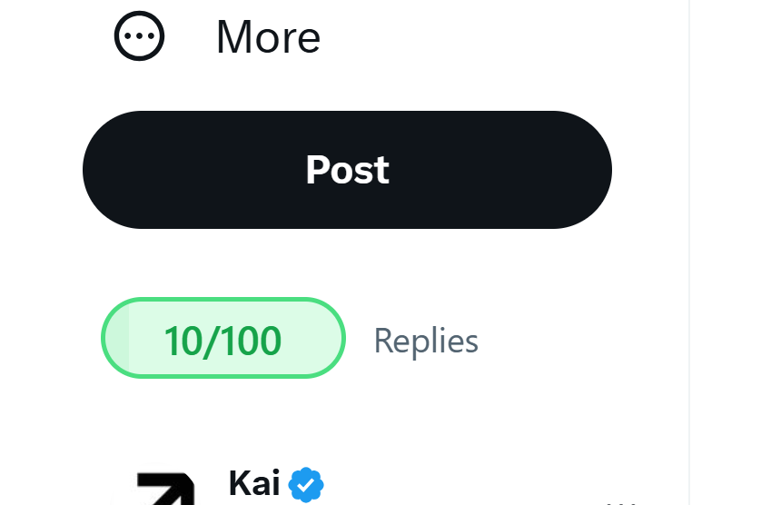
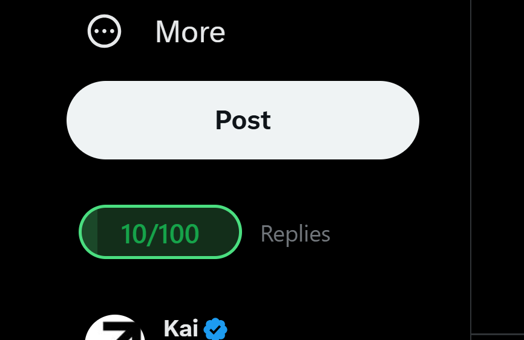

  
  <h1>Replyguy/Acc</h1>

## Description

Replyguy/Acc is a Chrome extension that helps you with your x dot com replyguying
It allows you to set a target reply count and track your progress.

## Installation

1. Download from the Chrome Web Store (coming soon)
2. Or install manually:
   - Clone this repository, or go to releases and download the zip file, then unzip it
   - Open Chrome or whatever browser you use and go to `chrome://extensions`
   - Enable Developer Mode
   - Click "Load unpacked" and select the extension directory

   Note - wont work with firefox since it doesnt use chromium

## Usage

1. Install the extension
2. Visit X.com
3. The reply counter will appear above the compose tweet box
4. Click the extension icon to:
   - Set maximum replies
   - Reset counter
   - Configure settings

## Screenshots

Click to view screenshots

| Light Mode | Dark Mode |
|------------|-----------|
|  |  |

## Configuration

Click the extension icon to access settings:
- Set maximum reply count
- Reset counter
- View current statistics

Made with ❤️ by @kaiwlson for replyguys

